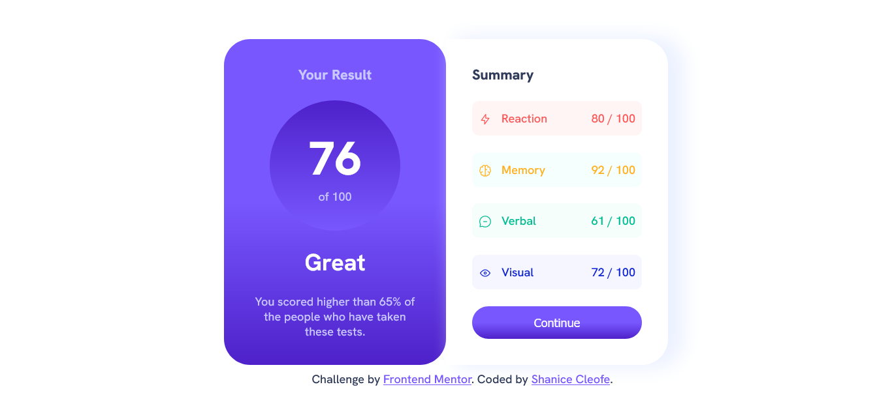
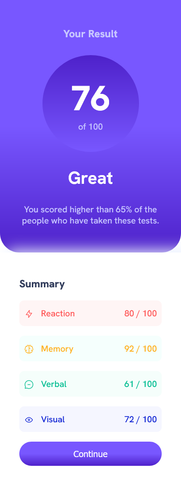

# Frontend Mentor - Results summary component solution

This is a solution to the [Results summary component challenge on Frontend Mentor](https://www.frontendmentor.io/challenges/results-summary-component-CE_K6s0maV). Frontend Mentor challenges help you improve your coding skills by building realistic projects. 

## Table of contents

- [Overview](#overview)
  - [The challenge](#the-challenge)
  - [Screenshot](#screenshot)
  - [Links](#links)
- [My process](#my-process)
  - [Built with](#built-with)
  - [What I learned](#what-i-learned)
  - [Useful resources](#useful-resources)
- [Author](#author)
- [Acknowledgments](#acknowledgments)

## Overview

### The challenge

Users should be able to:

- View the optimal layout for the interface depending on their device's screen size
- See hover and focus states for all interactive elements on the page
- **Bonus**: Use the local JSON data to dynamically populate the content

### Screenshot

Desktop Preview
---------------

Mobile Preview
---------------

### Links

- Solution URL: [Solution](https://www.frontendmentor.io/solutions/results-summary-component-MefqDhfSVB)
- Live Site URL: [Result Summary Layout](https://sdacleofe.github.io/results-summary-component-main/)

## My process

### Built with

- Semantic HTML5 markup
- CSS custom properties
- Flexbox

**Note: These are just examples. Delete this note and replace the list above with your own choices**

### What I learned

Took this basic project to further practice my skills in HMTL5, CSS and Flexbox.

### Useful resources

- [ChatGPT](https://chat.openai.com/) - This helped me for finding a specific question. I really liked this pattern and will use it going forward.

## Author

- Website - [Shanice Dawn](https://sdacleofe.github.io/about-me/)
- Frontend Mentor - [@sdacleofe](https://www.frontendmentor.io/profile/sdacleofe)
